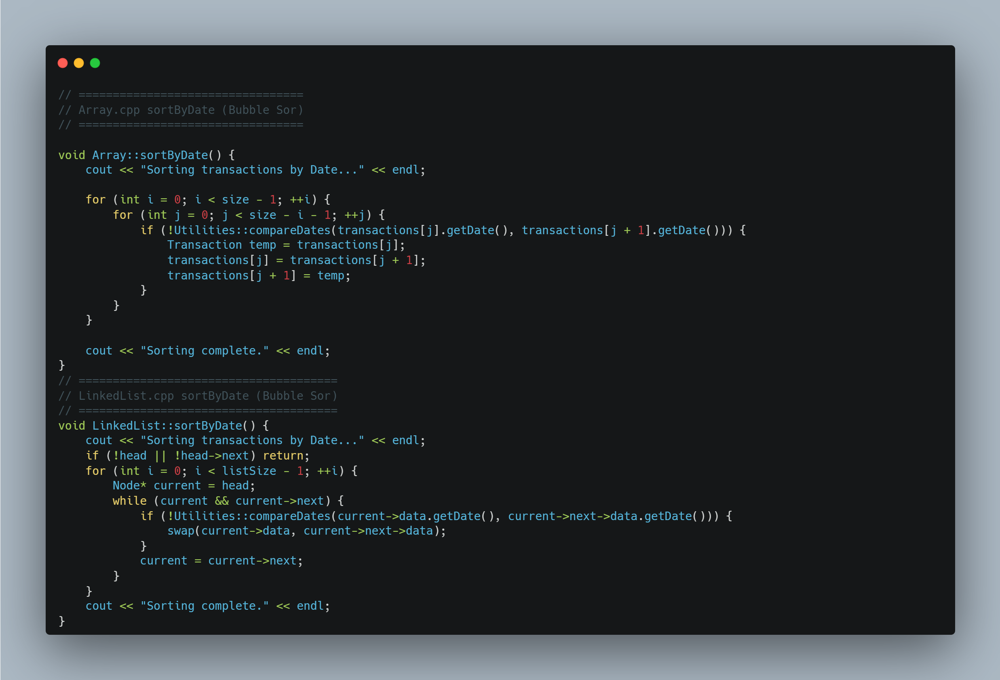
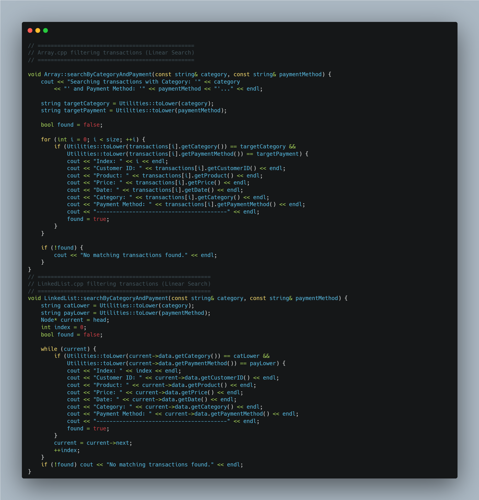
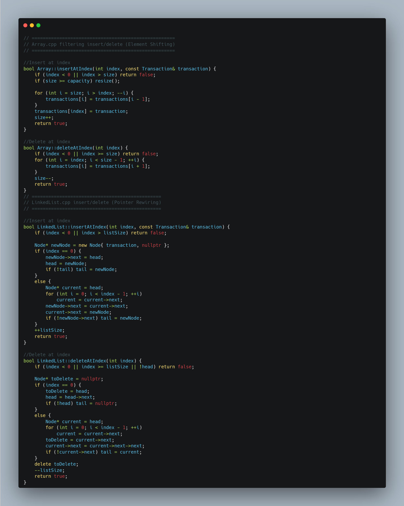
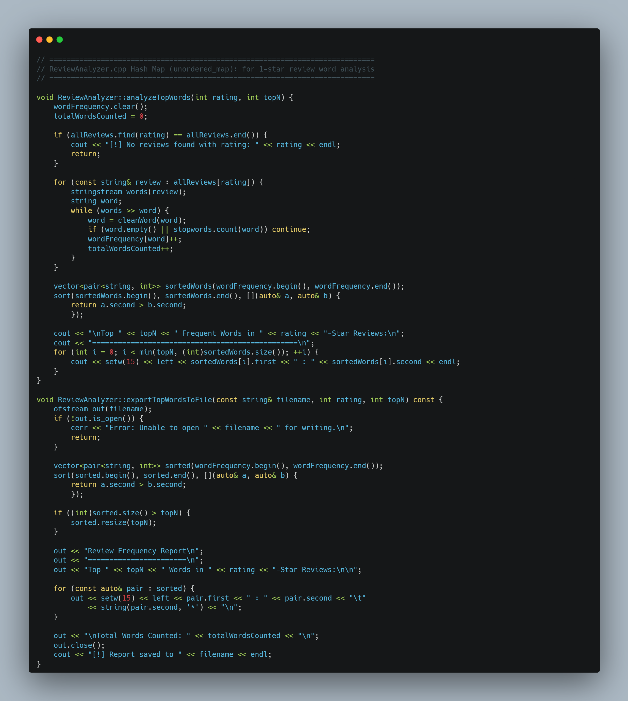
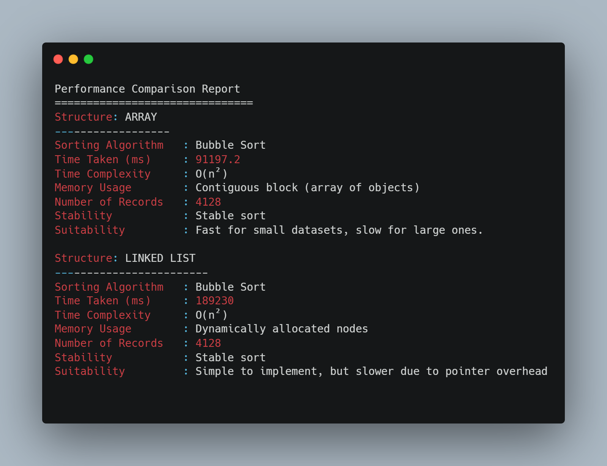
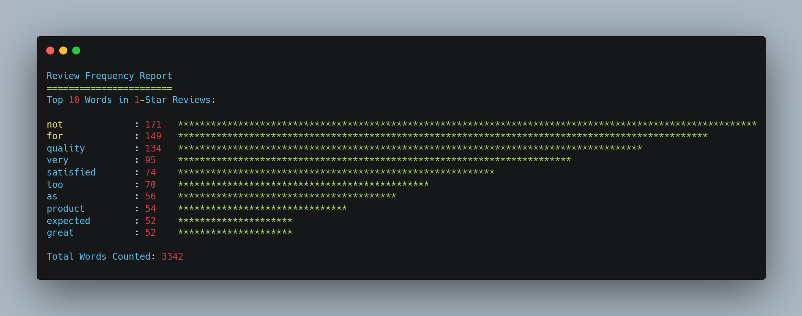

# Customer Behavior Analysis System 📊

This C++ project is a **menu-driven transaction management system** that helps analyze customer purchase behaviors using two fundamental data structures: **Array** and **Singly Linked List**. It enables users to display, sort, insert, delete, and search transaction data, along with measuring performance and analyzing 1-star customer reviews.


<p align="center">
  
  <br/>
  
</p>


## 🔧 Key Features

### ✅ Array & Linked List Implementations
- Display all transactions
- Sort transactions by date (Bubble Sort)
- Search by category and payment method (Linear Search)
- Insert/delete transaction by index
- Calculate purchase percentage by category/payment combo
- Performance test with custom Timer utility

### 📄 CSV-Based Data Handling
- Loads cleaned transactional dataset (4128 records)
- Reads and groups reviews by star rating

### 🧠 ReviewAnalyzer
- Displays top frequent words in 1-star reviews
- Hash Map used for word frequency counting
- Optionally exports to `ReviewFrequencyReport.txt` with simple bar chart


## 💡 Algorithms Used
- **Bubble Sort** (O(n²)): for sorting by date
- **Linear Search** (O(n)): for filtering transactions
- **Element Shifting** (Array): for insert/delete
- **Pointer Rewiring** (Linked List): for insert/delete
- **Hash Map (unordered_map)**: for 1-star review word analysis

## 📸 Algorithms Code Snippet
- **Bubble Sort** (O(n²)): for sorting by date

  
- **Linear Search** (O(n)): for filtering transactions


- **Element Shifting & Pointer Rewiring** (Array/LinkedList): for insert/delete


- **Hash Map (unordered_map)**: for 1-star review word analysis



## 📈 Performance Snapshot

### Sorting Time (from `PerformanceReport.txt`)




## 📸 Screenshots

### 📌 Linked-List/Array-Based Sorting Performance


### ⭐ ReviewAnalyzer Output


---

## 📁 Folder Structure
```
📦 CustomerBehaviorAnalysis_Project
┣ 📂 ArrayImplementation
┃ ┣ 📜 Array.h         (Header file for array data structure)
┃ ┣ 📜 Array.cpp       (Implementation file for array operations)
┃ ┣ 📜 ArrayMain.cpp   (Main program using Array)
┃ ┗ 📜 transactions.csv (Dataset copy for array testing)
┣ 📂 LinkedListImplementation
┃ ┣ 📜 LinkedList.h    (Header file for linked list data structure)
┃ ┣ 📜 LinkedList.cpp  (Implementation file for linked list operations)
┃ ┣ 📜 LinkedListMain.cpp (Main program using Linked List)
┃ ┗ 📜 transactions.csv (Dataset copy for linked list testing)
┣ 📂 ReviewAnalysis
┃ ┣ 📜 ReviewAnalyzer.h (Header file for review text analysis)
┃ ┣ 📜 ReviewAnalyzer.cpp (Implementation file for analyzing 1-star reviews)
┃ ┗ 📜 reviews.csv     (Dataset for review analysis)
┣ 📂 Documentation
┃ ┣ 📜 Report.docx     (Word Report: Introduction, Methods, Results, Workload Matrix, References)
┃ ┗ 📜 Graphs_Charts   (Folder for Performance Graphs - screenshots of timings/memory)
┣ 📂 PerformanceTests
┃ ┣ 📜 Timer.h         (Header for timing functions)
┃ ┣ 📜 Timer.cpp       (Implementation of timing and simple memory tracking)
┃ ┣ 📜 PerformanceReport.txt (Result of time/memory performance tests)
┣ 📂 FinalSubmission
┃ ┣ 📦 FinalZipUpload  (folder where you prepare the ZIP)
┃ ┣ 📦 FinalVideoUpload (put your 30-min video here separately)
┣ 📂 HelperScripts
┃ ┣ 📜 CSVLoader.h     (Helper for loading CSV data)
┃ ┣ 📜 CSVLoader.cpp
┃ ┣ 📜 Utilities.h     (Small utility functions: string cleaning, case normalization)
┃ ┗ 📜 Utilities.cpp
┣ 📜 README.md         (Simple description of the project structure)
┣ 📜 .gitignore        (Optional: to ignore temp files if using Git)
```

---

## 🧑‍💻 Built With
- Visual Studio 2022
- C++17
- Git & GitHub

---

## 📃 License
MIT License

---

<hr>

<h3 align="center">📬 Let's Connect</h3>
<p align="center">
  <a href="https://almaflehidev.com">🌐 almaflehidev.com</a> •
  <a href="https://tinyurl.com/yx3ks56u">💼 LinkedIn</a>
</p>

